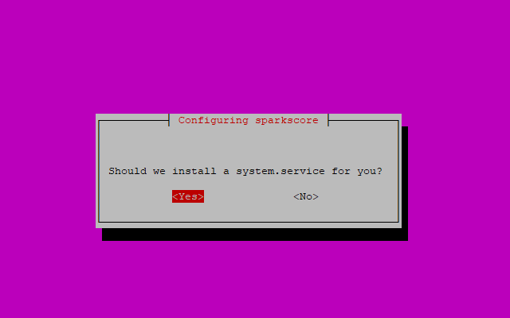
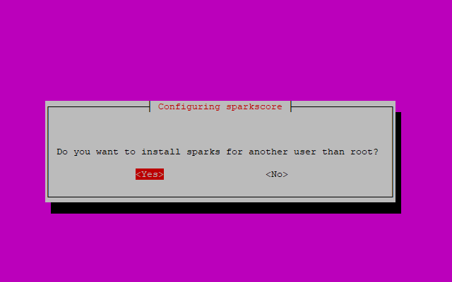
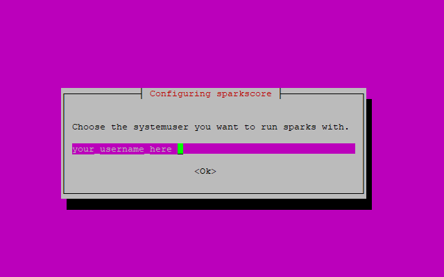
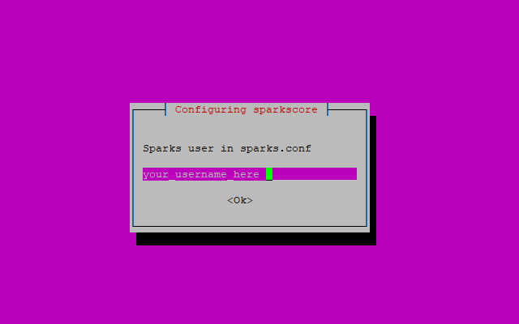
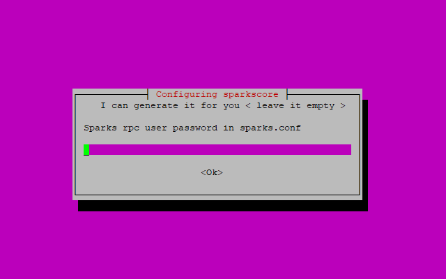
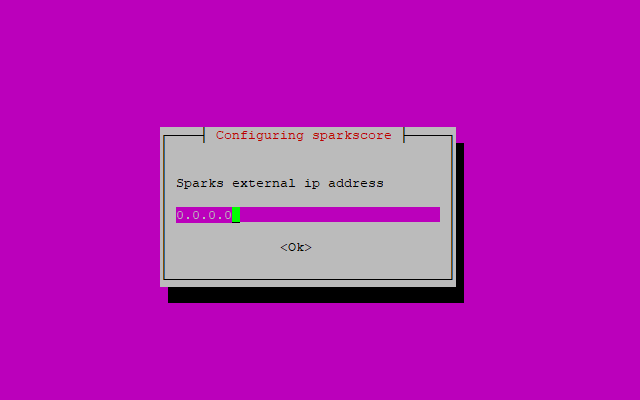
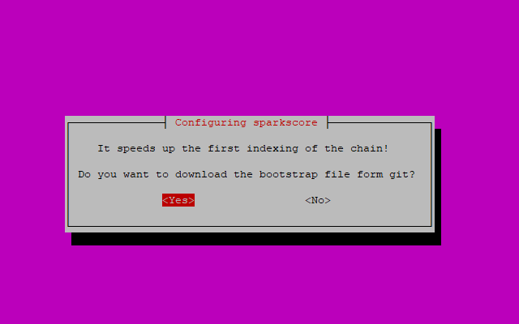
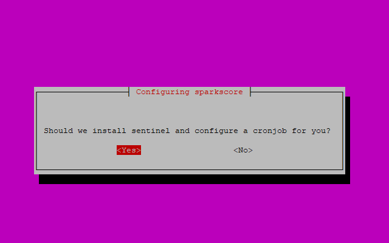
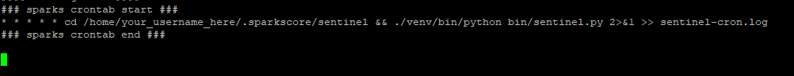

# SparksCore 0.12.3.5 - 0.12.4 
Prevered System => debian 9, ubuntu 16.04 +  
Min Sysspecs => 1 CPU, 1Ghz, 1GB RAM, 2GB SWAP, 20GB HDD  

### Files and more
Everybody who is not interested **SKIP** this info.  
After sucessfull installation there will be a config folder in  
**/opt/sparks**. This folder is not removed after install because you  
could reinstall the package in terms of multible sparks installation   
with multiIP settings.  
  
The sparksd.service is started with the -disablewallet flag, so if  
you are choosing the hot-cold wallet mode you need no walletfunction on
server.  
  
People who don't want to run a hot wallet on another system (ie Windows)  
need to remove the startup parameter from sparksd.service an easy  
command for this would be ...

```` bash
root@server:~# sed -i "s/\-disablewallet//g" /etc/systemd/system/sparksd.service
### don't forget ###
root@server:~# systemctl daemon-reload
root@server:~# systemctl restart sparksd
````  
  
Sparks will be installed in your **~/.sparkscore** home directory so don't  
forget to change parameters (ie masternodeprivkey) to fit your needs.  

#### ALL DONE
Then enable sparksd.service on startup
````
root@server:~# systemctl enable sparksd
````  


### MAINTAINER of SPARKS
Maintainer = http://sparkspay.io  
Explorer = http://expolorer.sparkspay.io  
sparks repo =   https://github.com/sparkspay/sparks
sentinel repo = https://github.com/sparkspay/sentinel  
binary download = https://github.com/sparkspay/sparks/releases

### REQUIREMENTS
Download this GIT 
git clone https://github.com/sparkspay/sparks-deb.git


## PreInstall process 
It's good to have a nonpriviledged user configured! Add user and  
put him into **sudo** group  
```` bash
### choose something else than sparky as username ###
root@server:~# adduser sparky && adduser sparky sudo

### forbit the root to login with ssh (optional) ###
root@server:~# nano /etc/ssh/sshd_config

### CHANGE PARAMs TO ##
.
.
PermitRootLogin no
StrictModes yes
.
.

### before you you logout the server test it with new ssh session ###
root@server:~# systemctl restart sshd

````
### ATTANTION
If you don't plan to configure a new user and you change the **PermitRootLogin**  
in your ssh server to **no**, you'll never be able to login from ssh again!  
So before you logout the server test your login with your new configured user. If 
this works you are fine to continue.


## Installation process
```` bash
root@server:~# apt install git ufw fail2ban
root@server:~# git clone https://m0r4k@bitbucket.org/m0r4k/sparky.git
root@server:~# cd sparky
root@server:~# dpkg -i sparkscore-0.12.3.2-amd64.deb

#### ERRORS WILL APEAR DON'T PANIK -> -f install will FIX deps ####

root@server:~# apt-get -f install

````

## PostInstall process
```` bash
user@server:~# sudo ufw default allow outgoing
user@server:~# sudo ufw default deny incoming
user@server:~# sudo ufw allow ssh/tcp
user@server:~# sudo ufw limit ssh/tcp
user@server:~# sudo ufw allow 8890/tcp
user@server:~# sudo ufw logging on
user@server:~# sudo ufw enable

### or go to the scripts folder and do ###
root@server:~/sparky/# sh ufw.sh

````
### ATTENTION  
If ufw is complaining about ipv6 you need to check
````
root@server:~/# nano /etc/default/ufw
### CHANGE Parameter ###

IPV6 = false 
````


## Dialog walkthrough


  

Accept if you want to install a system.service on your server the file    
will be located on **/etc/systemd/system/$coin_name.service**  
***

  

If you say **YES** you'll get the next dialog to choose the user you  
want to configure sentinel / masternode and systemservice to run.  
  
On **No** sparkscore will install as root ( not recommended )  
***

  
Here you type in your username, delete suggested root and type in your
username
***

  
Same as the "system user" you can specify a username for your sparks.conf  
***

  
You are free to leave it empty because the script will generate a **random**  
and quite safe password in sparks.conf  
***

  
The Coin RPC Port could collidate with other coins on multi MN settings. You  
can easly choose a free and unused port for you!  
***  

  
If you have a multiple IP settings on your server you can configure your  
external IP. Leave it empty if you want to get your external IP automated.  
***  

  
You can speed up your first indexing of blocks if you say **Yes** the  
boostrap.file will be downloaded and install in your coincore directory.  
***  

  
Some coins do need sentinel from their maintainer. If this dialog appears  
you can say **YES** and your sentinel client will be installed automatically.  
***

  
Here you are > if you left the Dialog with your external IP Settings empty  
this Dialog will show you what network script thinks your external IP is.  
***

  
Logout as root and login as "USER" type the command  

````bash
user@server:~# crontab -l
````
